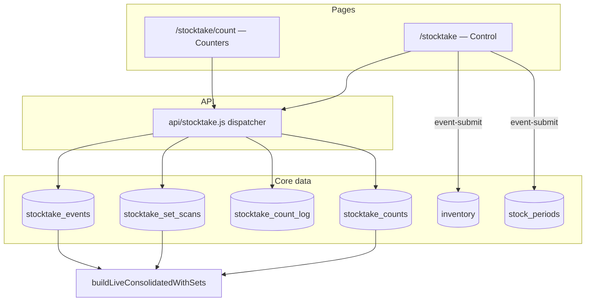

# Stocktake Flow — Technical Reference

This document describes routes, API actions, database behaviour, and end-to-end logic for the stocktake feature. It is meant for developers and operators debugging the system.

Companion guide (procedure only, no endpoints): [`stocktake-procedure.md`](./stocktake-procedure.md).

---

## Architecture overview



- **Single serverless dispatcher:** `api/stocktake.js`
- **Public rewrite paths:** `/api/stocktake-<action>` (and `/api/auth-profile`) mapped in `vercel.json`
- **Client service:** `src/services/stocktake.js`
- **Live set derivation:** `src/utils/stocktakeLiveTotals.js`
- **Excel parse/sample:** `src/utils/stocktakeQtyImport.js`
- **Schema:** `supabase/sql/migrations/20260710_stocktake_flow_v3.sql`

---

## Routes

| Route | Component | Auth |
|-------|-----------|------|
| `/stocktake` | `StocktakeControlPage` | App auth (`RequireAuth`); stocktake access required |
| `/stocktake/count` | `StocktakeCountSessionPage` | Public route; own Supabase Auth login (Google or email/password) |
| `/stocktake-periods`, `/stock-periods`, legacy stocktake URLs | Redirect | → `/stocktake` or `/stocktake/count` |
| `/stocktake/count/:eventId` | Redirect | → `/stocktake/count` (selected event stored in browser storage, not the URL) |

Count-page browser keys (non-secret UI state only):

- `stocktake:countUser` — counter identity after login
- `stocktake:countEventId` — selected open session id

---

## Status values

| Entity | Values |
|--------|--------|
| `stocktake_events.status` | `counting`, `submitted`, `cancelled` |
| `stock_periods.status` | `open`, `closed` |
| Submit response `submitType` | `initial`, `rollover` |

Gate flag: `stocktake_events.counting_enabled` (boolean). Sessions are created with counting enabled. API count handlers primarily enforce `status === 'counting'`.

---

## API surface

All actions resolve through:

```http
GET|POST /api/stocktake?action=<canonical-action>
```

Vercel rewrites also expose friendly paths such as `/api/stocktake-event-submit`. Canonical names and aliases live in `ACTION_METHOD` / `ACTION_ALIAS` inside `api/stocktake.js`.

### Auth / catalogue / sessions

| Action | Method | Rewrite | Purpose |
|--------|--------|---------|---------|
| `login` | POST | `/api/stocktake-login` | Email/password sign-in for count page |
| `auth-profile` | GET | `/api/auth-profile` | Bearer token → app user profile |
| `locations` | GET | `/api/stocktake-locations` | List locations |
| `location-state` | GET | `/api/stocktake-location-state` | `initial_completed` for a location |
| `catalog` | GET | `/api/stocktake-catalog` | Location products + sets (searchable) |
| `open-sessions` | GET | `/api/stocktake-open-sessions` | All events with `status=counting` |
| `events-list` | GET | `/api/stocktake-events-list` | Events for one location |
| `event-get` | GET | `/api/stocktake-event-get` | Event + counts + consolidated live totals |
| `event-create` | POST | `/api/stocktake-event-create` | Start counting session (409 if one already open for location) |
| `event-set-gate` | POST | `/api/stocktake-event-set-gate` | Toggle `counting_enabled` + gate audit |
| `event-cancel` | POST | `/api/stocktake-event-cancel` | Cancel empty session only |
| `event-submit` | POST | `/api/stocktake-event-submit` | Apply inventory + periods; close event |

### Counting

| Action | Method | Rewrite | Purpose |
|--------|--------|---------|---------|
| `count-add` | POST | `/api/stocktake-count-add` | Cumulative qty add for one product + user |
| `count-mine` | GET | `/api/stocktake-count-mine` | That user’s cart for an event |
| `count-remove-mine` | POST | `/api/stocktake-count-remove-mine` | Remove one product line for user |
| `count-clear-mine` | POST | `/api/stocktake-count-clear-mine` | Clear that user’s counts, log lines, set scans |
| `counts-import` | POST | `/api/stocktake-counts-import` | Excel rows → absolute qty per user |
| `counts-clear` | POST | `/api/stocktake-counts-clear` | Wipe all users’ counts/log/scans for event |
| `set-scan` | POST | `/api/stocktake-set-scan` | Expand set BOM into component adds + scan row |
| `import-template` | GET | `/api/stocktake-import-template` | Sample rows for location |
| `product-create` | POST | `/api/stocktake-product-create` | Create product, link location, seed inventory 0 |
| `set-create` | POST | `/api/stocktake-set-create` | Create combo + components + location link |

### Periods

| Action | Method | Rewrite | Purpose |
|--------|--------|---------|---------|
| `periods-list` | GET | `/api/stocktake-periods-list` | Periods for location |
| `period-detail` | GET | `/api/stocktake-period-detail` | Period + opening/closing entries |
| `period-variance` | GET | `/api/stocktake-period-variance` | Closed-period variance rows + company header |

### Client fallback behaviour

`src/services/stocktake.js` may fall back to direct Supabase for many read/write ops if the Vercel API is unreachable.

**No client fallback** (must hit the API):

- `importCounts`
- `submitEvent`
- `createSet`
- `getPeriodVariance`

---

## Core tables

| Table | Role |
|-------|------|
| `stocktake_location_state` | Per-location `initial_completed` |
| `stocktake_events` | One counting session per open location |
| `stocktake_counts` | Unique `(event_id, product_id, user_email)`; running qty |
| `stocktake_count_log` | Per change audit (`qty_added`, `qty_after`) |
| `stocktake_set_scans` | Unique `(event_id, combo_id, user_email)`; set attribution |
| `stocktake_gate_audit` | Counting gate on/off history |
| `inventory` | Updated only on submit; conflict key `(product_id, location)` |
| `stock_periods` | Open/closed periods; links via `source_event_id` / event period ids |
| `opening_stock_entries` / `closing_stock_entries` | Period qty snapshots |
| `product_locations` | Which products are in scope for a location |
| `combo_locations` / `combos` / `combo_items` | Sets + BOM |
| `products` / `locations` | Masters |
| `company_settings` | Variance PDF header |

Control-page activity (separate from stocktake tables) is written to `user_activity_log` with action types such as:

- `stocktake_event_create`
- `stocktake_event_cancel`
- `stocktake_counts_clear`
- `stocktake_counts_import`
- `stocktake_submit`

Counter UI actions rely on `stocktake_count_log` / `stocktake_set_scans` rather than `user_activity_log`.

---

## End-to-end logic

### 1. Start session (`event-create`)

1. Reject if a `counting` event already exists for `location_id`.
2. Read `stocktake_location_state.initial_completed`.
3. Insert `stocktake_events` with:
   - `status: counting`
   - `counting_enabled: true`
   - `is_initial: !initial_completed`
4. Insert `stocktake_gate_audit` (`enabled: true`).

### 2. Catalogue (`catalog`)

- **Products:** union of `product_locations` and existing `inventory` rows for the location (then filter by search term when provided).
- **Sets:** combos linked in `combo_locations` for the location, with `combo_items` attached.

### 3. Add product count (`count-add`)

1. Assert event `status === counting`.
2. Assert product is allowed at event location.
3. Upsert `stocktake_counts` — new qty = previous + add.
4. Append `stocktake_count_log`.

### 4. Scan / count set (`set-scan`)

1. Assert event counting + combo enabled at location.
2. Load `combo_items`.
3. Upsert `stocktake_set_scans` (cumulative `set_qty` for user + combo).
4. For each component: `qtyAdd = component_qty * setQty` via the same add-count path.

Cart rows remain **product/component** lines only.

### 5. Import (`counts-import`)

1. Parse rows: SKU, Product Name, Quantity.
2. Match product by SKU, else name; must be in `product_locations` for the session location.
3. Reject set SKUs / set names.
4. For each accepted row, set **absolute** qty for the importing user (`setCountAbsolute`) and log the delta.

### 6. Clear variants

| Action | Scope |
|--------|-------|
| `count-clear-mine` | One user’s counts + their log + their set scans |
| `count-remove-mine` | One product for one user (+ matching log) |
| `counts-clear` | All users’ counts, log, and set scans; event stays `counting` |
| `event-cancel` | Only if zero counts and zero set scans → `status: cancelled` |

Sign-out on the count page clears local login storage only. Server counts are unchanged.

### 7. Live totals

`event-get` (and control polling) builds consolidated rows with `buildLiveConsolidatedWithSets`:

1. Sum all users’ component counts.
2. For each location-enabled combo, derive complete sets as  
   `min(floor(component_qty / need))` across BOM lines.
3. Deduct components consumed by those sets.
4. Emit set rows (`row_type: 'set'`) marked `scanned` if set-scan rows exist, else `derived`.
5. Emit leftover product rows with metadata for UI expanders.

Variance PDF reconstruction for closed periods uses the same set logic on closing quantities.

### 8. Submit (`event-submit`)

Requires `status === counting`.

**A. Aggregate**

- Page through all `stocktake_counts` for the event (beyond default row caps).
- Sum qty by `product_id`.

**B. Zero uncounted (location-scoped)**

- Load all `product_id`s from `product_locations` for `event.location_id`.
- Load all `product_id`s from `inventory` where `location = event.location_id`.
- Any of those not present in the totals map is set to `0`.
- Other locations are never written.

**C. Inventory upsert**

- Upsert chunks on conflict `(product_id, location)`.
- Sets are **not** inventory SKUs; only component products are written.

**D. Gate audit**

- Insert `stocktake_gate_audit` with `enabled: false`.
- Count rows and logs are **retained** for audit (not deleted on submit).

**E. Periods**

If `initial_completed` is false (**initial**):

1. Insert open `stock_periods`.
2. Upsert `opening_stock_entries` from totals.
3. Mark `stocktake_location_state.initial_completed = true`.
4. Update event → `submitted`, store `opened_period_id`, `is_initial: true`.

If `initial_completed` is true (**rollover**):

1. Find current open period for the location.
2. Write `closing_stock_entries` from totals; close period (`status: closed`, variance flag set).
3. Insert next open period; write its `opening_stock_entries`.
4. Update event → `submitted` with `closed_period_id` + `opened_period_id`.

**F. Client follow-up**

- Control logs `stocktake_submit` to `user_activity_log`.
- On rollover, control may download variance PDF via `period-variance`.
- Count page polling sees non-`counting` status and ends the local session selection.

---

## Location scoping rules (invariant)

| Operation | Scope |
|-----------|--------|
| Catalogue / import eligibility | Session location |
| Count add / set scan | Session location enablement checks |
| Inventory write on submit | `event.location_id` only |
| Period open/close | That location only |
| Zero uncounted products | Products linked or already inventoried **at that location** |

---

## Persistence matrix

| Action | Counts | Count log | Set scans | Event | Inventory | Periods |
|--------|--------|-----------|-----------|-------|-----------|---------|
| Counter sign-out | Kept | Kept | Kept | Unchanged | Unchanged | Unchanged |
| Clear my cart | User deleted | User deleted | User deleted | `counting` | Unchanged | Unchanged |
| Clear all counts | All deleted | All deleted | All deleted | `counting` | Unchanged | Unchanged |
| Close empty session | N/A (must be empty) | N/A | N/A | `cancelled` | Unchanged | Unchanged |
| Submit | **Kept** | **Kept** | **Kept** | `submitted` | **Updated** | **Updated** |

---

## Excel contract

Headers (aliases accepted in the parser): **SKU**, **Product Name**, **Quantity**.

Files: `.xlsx`, `.xls`, `.csv`.

Matching order: SKU → Product Name → must exist on `product_locations` for the session location. Sets rejected. Quantity must be a valid number; blank identity rows skipped.

Import qty behaviour: **absolute** for the importing user (not additive).

---

## UI ↔ logic notes

### Control (`StocktakeControlPage`)

- Start / cancel / clear / import / submit call the API and log to `user_activity_log`.
- Live totals poll while a counting event is active.
- Submit blocked in UI when consolidated totals are empty.

### Count (`StocktakeCountSessionPage`)

- Polls open sessions and selected event.
- Location display is text (or choice chips if multiple open sessions).
- Search-driven catalogue; create product/set refreshes search automatically.
- Cart is server-backed; sign-out does not clear server counts.
- Long-press / actions can remove a line or open qty entry.

---

## Known implementation caveats

1. `event-set-gate` exists in the API; the main control UI may not expose a gate toggle (sessions start enabled).
2. Import sample template is based on `product_locations`; catalogue/submit also consider inventory-only products at the location.
3. Submit/import/create-set/variance require the Vercel API path (no silent Supabase-only completion).
4. Large location catalogues on submit are paged so default API row limits do not truncate zeroing or count aggregation.

---

## Related files

| Area | Path |
|------|------|
| Dispatcher | `api/stocktake.js` |
| Client API | `src/services/stocktake.js` |
| Control UI | `src/StocktakeControlPage.js` |
| Count UI | `src/StocktakeCountSessionPage.js` |
| Live totals | `src/utils/stocktakeLiveTotals.js` |
| Excel helpers | `src/utils/stocktakeQtyImport.js` |
| Rewrites | `vercel.json` |
| Schema | `supabase/sql/migrations/20260710_stocktake_flow_v3.sql` |
| Lab seed | `supabase/sql/migrations/20260710_seed_test_stocktake_lab.sql` |
| Short overview | `docs/stocktake-flow.md` |
| Operator procedure | `docs/stocktake-procedure.md` |
